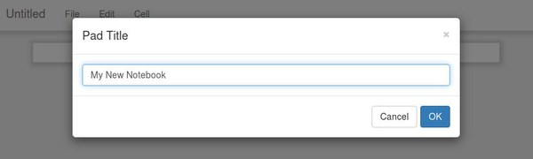
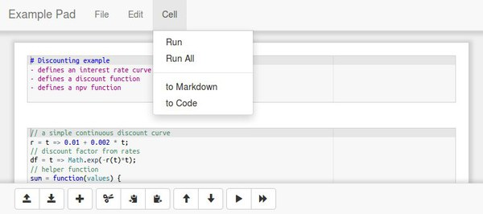
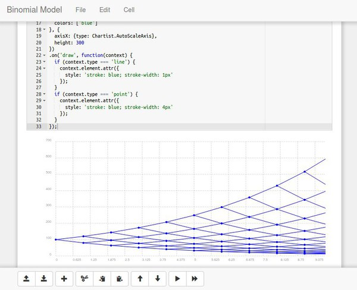

# arithmepad
arithmepad is a JavaScript based web notebook than runs entirely in the
browser. There is no server side component. Look and feel as well as
behaviour has been heavily inspired and shamelessly copied from
[Jupyter Notebooks](https://jupyter.org/). Feel free to check out the [demo](https://rawcdn.githack.com/luphord/arithmepad/b201276b882f332c798611ef9e7a64275641bc50/index.html).

## Screenshots

#### Rename current pad

#### Using menus and buttons

#### Plot example

## Install / Usage

Simply put the content of this repo (at least `index.html` and the `assets` folder) on a static web server and open the page in your browser. There is no server-side code required, everything runs inside the browser.

Pads (i.e. notebooks) can be downloaded to files (and uploaded back). For some example pads, see the `examples` folder.

## History

## v0.1.0 (2020-06-07)
* Release of the code mostly as imported from fossil 2015

## Restart in 2020
In need of a simple way to give potential users a tool to experiment with [gaussian-analytics.js](https://github.com/luphord/gaussian-analytics)
I was looking for JavaScript web notebook. [Iodide](https://github.com/iodide-project/iodide) was still in alpha
and there seemed to be no easy way to self-host it on a static server. Also, I could not find any
other promising alternatives. arithmepad in contrast gave me all the features I required
but loading JavaScript examples by URL. So I decided to restart the project in June 2020.

## Deprecation in 2019
Not having worked on arithmepad for more than three years, I decided to deprecate
the project in early 2019. I considered [Iodide](https://github.com/iodide-project/iodide)
as an alternative, which was actively maintained and of far better quality than arithmepad
ever could be.

## Development in 2015
arithmepad was developed to have a web based JavaScript notebook for the browser.
It was meant to be simple, both in usage as well as in hosting (no requirements
but a static web server) at the expense of more advanced features.